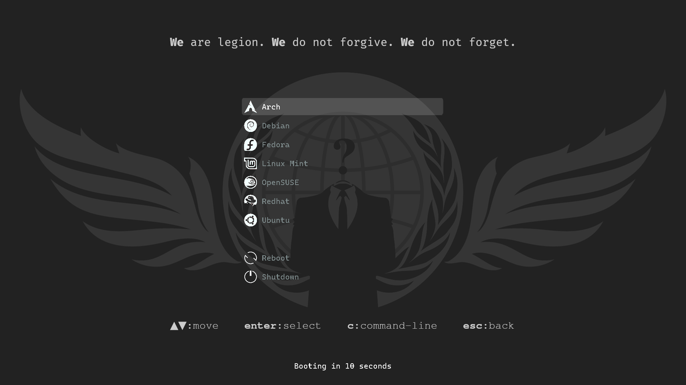

# Overview
A collection of themes I have created for GRUB.

# Installation
- Copy the selected theme's folder to `/boot/grub/themes`.
- Add the full path to its `theme.txt` in `/etc/default/grub`.
- Update the grub configuration by running `sudo update-grub`.
- Reboot the system to view the new GRUB theme.

# License
License information for each theme is contained within its folder.

# Developer
- [Foster Hangdaan](https://github.com/FosterHangdaan)

# Screenshots
## Anonymous

